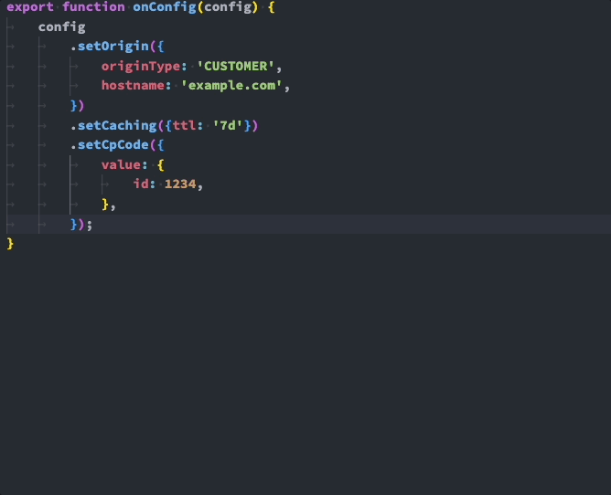

<a name="top"></a>
<p align="center"></p>
<h1 align="center">Programmable CDN Tech Preview</h1>
<div align="center">
  <a href='https://github.com/akamai/akj-tech-preview/blob/main/LICENSE.md'></a>
  <a href="https://npmjs.org/package/akj-tech-preview"></a>
</div>

<br />
<div align="center">
  Interact with the Akamai <a href="https://techdocs.akamai.com/property-mgr/reference/api">Property Manager API</a> and <a href="https://techdocs.akamai.com/edgeworkers/docs/welcome-to-edgeworkers">EdgeWorkers</a> through JavaScript code.
</div>
<br />

> [!IMPORTANT]
>
> The goal of this tech preview is to gather feedback to further refine the existing capabilities and to identify areas for future development. This tech preview product may contain usability limitations and possibly some bugs. Do not use this tool to create or update properties enabled on the Akamai production network.
<br />

<details>
  <summary>Table of Contents</summary>
  <ol>
    <li>
      <a href="#getting-started">Getting Started</a>
      <ul>
        <li><a href="#prerequisites">Prerequisites</a></li>
        <li><a href="#installation">Installation</a></li>
      </ul>
    </li>
    <li><a href="#usage">Usage</a></li>
    <li><a href="#examples">Examples</a></li>
    <li><a href="#license">License</a></li>
  </ol>
</details>

## Getting Started

### Prerequisites

- Node.js >= 21.6.0
- npm >= 10.2.4
- [Akamai EdgeGrid Credentials](https://techdocs.akamai.com/developer/docs/authenticate-with-edgegrid)

#### Required EdgeGrid Access

|Permission | Access Level | Usage |
| :---: | :---: | :--- |
| Contracts-API_Contracts | READ-ONLY | Listing available contracts within the `init` behaviour |
| CPcode and Reporting group (cprg) | READ-WRITE | Listing and creating cpcodes |
| Edge Hostnames API (hapi) | READ-WRITE | Creating Edge Hostnames when creating a new property |
| EdgeWorkers | READ-WRITE | Creating and updating EdgeWorkers |
| Property Manager (PAPI) | READ-WRITE | Creating and updating properties |

[Akamai Techdocs](https://techdocs.akamai.com/developer/docs/create-a-client-with-custom-permissions) contains instructions on how to create an API client with custom permissions.

### Installation
```sh
npm install --save-dev akj-tech-preview
```

<p align="right">(<a href="#top">back to top</a>)</p>

## Usage

The Programmable CDN tech preview installs the `akj` command.

```
Usage: akj [options] [command]

Generates PAPI JSON from an onConfig() function

Options:
  -V, --version                 output the version number
  -e, --edgerc <path>           Path to your .edgerc authorization file. (default: "/home/node/.edgerc")
  -s, --section <name>          Section of your .edgerc to use. (default: "default")
  -a, --accountSwitchKey <key>  Account switch key.
  -D, --debug                   Show debug output
  -h, --help                    display help for command

Commands:
  activate [options] [base]     Generates PAPI JSON from an onConfig() function and upload it to Property Manager
  init [base]                   Configure a Property to use.  Either by creating a new property or finding an existing one.
  help [command]                display help for command
```

The `akj` command comprises two subcommands:

1. `init` - A guided setup for the files and structure necessary to use the tool.
2. `activate` - Run JavaScript code to modify a Property and EdgeWorker

### Initializing

Run the guided installation.

```sh
  npx akj init 
```

> [!IMPORTANT]
>
> The Akamai Programmable CDN tool requires the user to accept the Terms & Conditions before being allowed to use the tool.

The tool requires the following to operate and will prompt for:
- An email address to receive notices from the Akamai services indicating resources have been created or activated.
- A [contract](https://techdocs.akamai.com/iam/docs/about-grp-contracts) to associate with any created resources
- A [group](https://techdocs.akamai.com/iam/docs/about-grp-contracts) to associate with any created resources
- A property to work with (either an existing property or the tool will assist in creating one)
- An EdgeWorker (either an existing EdgeWorker or the tool with assist in creating one)
- A CPCode to associate with the created files.

When the guided initialization is complete, 4 new files will be created:

- `property.json` - Information needed to call the Property Manager API
- `src/bundle.json` - The [EdgeWorker manifest file](https://techdocs.akamai.com/edgeworkers/docs/code-bundle-format).
- `src/main.js` - The [EdgeWorker JavaScript source file](https://techdocs.akamai.com/edgeworkers/docs/create-a-code-bundle).
- `src/config.js` - The JavaScript configuration file that will be used to create the Akamai Property.

<p align="right">(<a href="#top">back to top</a>)</p>

### Writing `config.js`
The `config.js` file is required to export an `onConfig` function. This function takes a single argument `config` of type `Property`.

```JavaScript
export function onConfig(config) {
  config
    .setOrigin({
      originType: 'CUSTOMER',
      hostname: 'www.example.com',
    })
    .setCaching({ttl: '7d'})
    .setCpCode({
      value: {
        id: 1234,
      },
    });
}
```

The `config` object provides a builder pattern interface to creating a property. In the previous code example, methods are chained together to set an [Origin behaviour](https://techdocs.akamai.com/property-mgr/docs/origin-server), a [caching behaviour](https://techdocs.akamai.com/property-mgr/docs/caching-2) and the [CP Code behaviour](https://techdocs.akamai.com/property-mgr/docs/content-provider-code-beh) for the Property.

[Rules](https://techdocs.akamai.com/property-mgr/docs/rules) can be used to group behaviours together or apply match criteria.  In the following example, a Rule containing matchers is created.  The `any` criteria specifies that the EdgeWorker behaviour will be added if either the [Query String Parameter](https://techdocs.akamai.com/property-mgr/docs/query-string-param) or the [Request Cookie](https://techdocs.akamai.com/property-mgr/docs/req-cookie) are present.

```JavaScript
export function onConfig(config) {
  config
    .setOrigin({
      originType: 'CUSTOMER',
      hostname: 'www.example.com',
    })
    .setCaching({ttl: '7d'})
    .setCpCode({
      value: {
        id: 1234,
      },
    });

  // Setup a rule matching either a Querystring or cookie is present
  config
    .newBlankRule('Conditional EdgeWorker', 'Conditionally apply the Specified EdgeWorker.')
    .any(rule => {
      rule.onQueryStringParameter({
        parameterName: 'ew-enabled',
        values: ['true', 'on', '1'],
      });
      rule.onRequestCookie({
        cookieName: 'ew-enabled',
        matchOperator: 'EXISTS',
      });
		})
		.setEdgeWorker({
			edgeWorkerId: '1234',
		});
}
```

When writing the `onConfig` files, configuring type checking allows for code completion and inline documentation.



### Activation

The `akj activate` command will use modified files to apply the `config.js` file to a property and the `bundle.json` and `main.js` files to an EdgeWorker.

```sh
Usage: akj activate [options] [base]

Generates PAPI JSON from an onConfig() function and upload it to Property Manager

Arguments:
  base                   Root of your PCDN property.

Options:
  -p, --property <path>  Optional path to the JSON file that contains property information
  -d, --dry-run          Stop execution after producing PAPI JSON. (default: false)
  -w, --stop-on-warning  Stop activating the property if there are warnings. (default: false)
  -j, --print-papi-json  Print the PAPI Json to the console during property operations. (default: false)
  -o, --save-only        Save the property version without activation. (default: false)
  -h, --help             display help for command
```

To activate the Property and EdgeWorker, run the following command from the directory containing your `property.json` and `src` folder:

```sh
npx akj activate
```


<p align="right">(<a href="#top">back to top</a>)</p>

## Examples

### Minimal Property

When creating a new property, there are a few required behaviours that need to be specified.  The minimal `onConfig` function is specified in the [minimalProperty](examples/minimalProperty/) example.

### Using Variables

`onConfig` can be used to setup [user defined variables](https://techdocs.akamai.com/property-mgr/docs/user-defined-vars). When using the Property Manager User Interface, variables are required to be defined in the `Property Variables` section.  When using the `config` object, variables can be defined implicitly using the `setVariable` function.

Using `setSetVariable` will defined the specific variable name for you, and allow its value to be set without needing to define it separately.

See the example [here](examples/userDefinedVariables/).

### Templating Based on Configuration Files

Brief description of the example we usually do with a `control.json` file that is parsed and applies rules in a loop.

### The Akamai Default Template

When creating a new property, the Akamai Control Center can populate a set of default behaviours and criteria.  The property will setup caching rules, enable MPulse RUM, log delivery, SureRoute and a variety of features.

See the example [here](examples/defaultTemplate/).

<p align="right">(<a href="#top">back to top</a>)</p>