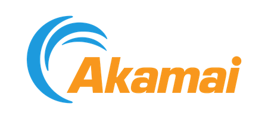

<h1 align="center">Programmable CDN Tech Preview</h1>

  
  
  

 

  Interact with the Akamai <a href="https://techdocs.akamai.com/property-mgr/reference/api">Property Manager API</a> and <a href="https://techdocs.akamai.com/edgeworkers/docs/welcome-to-edgeworkers">EdgeWorkers</a> through JavaScript code.

 

> [!IMPORTANT]
>
> The goal of this tech preview is to gather feedback to further refine the existing capabilities and to identify areas for future development. This tech preview product may contain usability limitations and possibly some bugs. Do not use this tool to create or update properties enabled on the Akamai production network.
 

# Default Rule Template
This configuration is based on the default rule template when creating an ION property.

When property manager creates the initial property, a number of configuration options are predefined:

1. An Origin Server
2. A default CP Code
3. mPulse reporting
4. Log Delivery
5. Connection Timeout settings
6. SureRoute
7. Offloading via cache settings for Images/Fonts/Files
8. HTTP Method configuration
9. And more!

This example contains a configuration that will build a similar configuration as a new Property created with the UI.