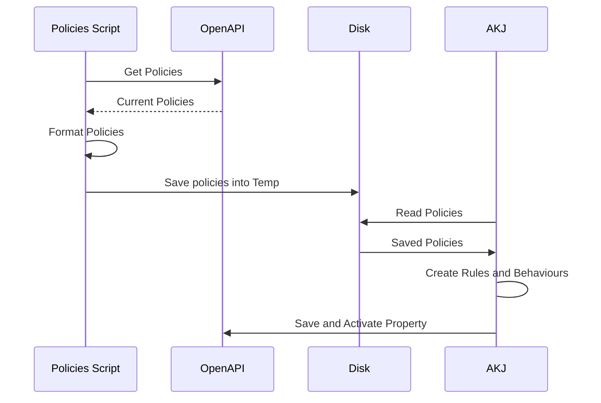

# Large Property Example

This is an example of a larger property that was converted into an `onConfig` file.  The property is added some sugar to automatically created rules based on an integration with the OpenAPI.  When the example is run, it will fetch existing Edge Redirector polices with a specific naming scheme and automatically create Rule templates for them.  The scenario is just an example of doing a more dynamic build chain.  This example could be integrated with a CI system polling for changes to EdgeRedirector policies and regenerating the property on demand.

The `onConfig` function is a synchronous function.  Akamai-EdgeGrid uses callbacks.  In order to merge these two paradigms, the example runs the download as a separate NodeJS script and the `onConfig` function reads the results from disk.

### High Level Workflow

This is just an example of combining APIs together to build something more dynamic.

## Additional Permissions
This requires an additional API permission beyond the standard tool:
- Cloudlets Policy Manager - READ-WRITE

The `setupFiles` npm script will integrate with the [List Shared Policies Cloudlets API](https://techdocs.akamai.com/cloudlets/reference/get-policies).  The files will temporarily be stored on disk in the `temp` folder so that the `onConfig` function can read them.

## Usage
This example requires you to perform an installation to use it.
Run `npm install` to install dependencies.

Ensure that a `.edgerc` file has been setup with the standard required credentials.
Run the `npx akj init` command as described in documentation to setup your `property.json` file.

Run the `npm script` to 
`ACCOUNT_SWITCH_KEY=<yourswitchkeyifneeded> npm run upload`

> [!IMPORTANT]
>
> To really run this example, you are going to need some EdgeRedirector properties that match the pattern described above.  By default, someone running this probably will not have any of those.